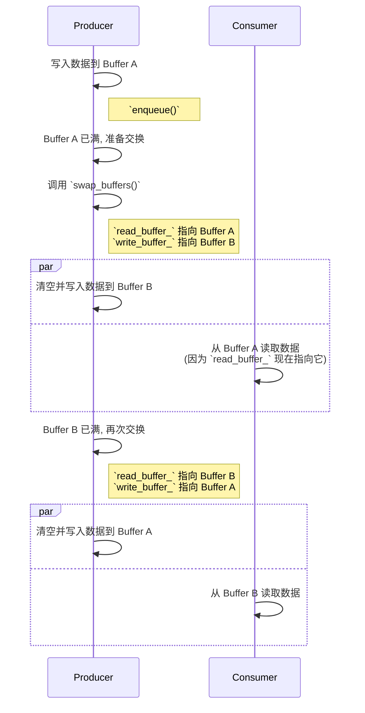

# 双缓冲队列实现原理
---

## `DoubleBufferSPSC` 实现原理解析

`DoubleBufferSPSC`（双缓冲单生产者单消费者）是一种高效的无锁队列模型，特别适用于批量数据传输场景。它的核心思想是**分离读写操作到不同的内存区域**，并通过一次原子的指针交换来完成数据的“发布”，从而最大限度地减少生产者和消费者之间的同步开销。

### 1. 核心数据结构

`DoubleBufferSPSC` 类包含以下关键成员：

```cpp
template<typename T>
class DoubleBufferSPSC {
private:
    std::vector<T> buffer1_;
    std::vector<T> buffer2_;
    
    // 指向当前写缓冲区的原子指针
    std::atomic<std::vector<T>*> write_buffer_; 
    
    // 指向当前读缓冲区的原子指针
    std::atomic<std::vector<T>*> read_buffer_;
    
    // 消费者在读缓冲区中的读取位置
    std::atomic<size_t> read_index_{0};
    
    // ...
};
```

*   `buffer1_`, `buffer2_`: 这是两个物理的数据缓冲区。在任何时刻，一个用于写入（生产者），另一个用于读取（消费者）。
*   `write_buffer_`, `read_buffer_`: 这两个是**原子指针**，是实现无锁同步的关键。它们分别指向两个物理缓冲区中的一个。生产者只通过 `write_buffer_` 写入，消费者只通过 `read_buffer_` 读取。
*   `read_index_`: 记录消费者当前在 `read_buffer_` 中读取到了哪个位置。

### 2. 工作流程与线程安全保证

`DoubleBufferSPSC` 的无锁安全机制建立在一个核心原则之上：**在任何时候，生产者和消费者访问的都是完全不同的内存区域（不同的缓冲区），唯一的同步点是指针的交换。**

#### 生产者流程 (Producer Thread)

1.  **入队操作 (`enqueue`)**:
    ```cpp
    template<typename U>
    bool enqueue(U&& item) {
        // 获取当前写缓冲区的指针
        auto* current_write_buffer = write_buffer_.load(std::memory_order_acquire);
        
        if (current_write_buffer->size() >= max_size_) {
            return false; // 写缓冲区已满
        }
        
        // 向缓冲区添加数据
        current_write_buffer->push_back(std::forward<U>(item));
        return true;
    }
    ```
    *   **安全性分析**: 生产者线程是唯一一个向 `write_buffer_` 所指向的缓冲区写入数据的线程。由于消费者线程永远不会触及这个缓冲区，因此在这里的写入操作是完全安全的，不需要任何锁。

2.  **交换缓冲区 (`swap_buffers`)**: 这是整个机制的核心。
    ```cpp
    void swap_buffers() {
        auto* current_write = write_buffer_.load(std::memory_order_acquire);
        auto* current_read = read_buffer_.load(std::memory_order_acquire);
        
        // 核心步骤：原子地交换读写缓冲区指针
        write_buffer_.store(current_read, std::memory_order_release);
        read_buffer_.store(current_write, std::memory_order_release);
        
        // 清空新的写缓冲区（即旧的读缓冲区）
        current_read->clear();
        read_index_.store(0, std::memory_order_release);
    }
    ```
    *   **安全性分析**:
        *   当生产者决定“发布”数据时，它调用 `swap_buffers`。
        *   这个函数原子地将 `write_buffer_` 和 `read_buffer_` 的值进行交换。
        *   **关键点**: `read_buffer_.store(current_write, std::memory_order_release)` 这一步是数据发布的信令。`std::memory_order_release` 内存顺序保证了**在此之前所有对 `current_write` 缓冲区（即生产者刚刚填满的那个）的写入操作，对于之后能看到这个新指针值的消费者线程都是可见的**。
        *   交换后，生产者获得了消费者已经读取完毕的旧 `read_buffer_`，并可以安全地清空它，为下一次写入做准备。
        *   同时，`read_index_` 被重置为0，供消费者在新切换的读缓冲区上使用。

#### 消费者流程 (Consumer Thread)

1.  **出队操作 (`dequeue`)**:
    ```cpp
    bool dequeue(T& item) {
        // 获取当前读缓冲区的指针
        auto* current_read_buffer = read_buffer_.load(std::memory_order_acquire);
        size_t current_read_index = read_index_.load(std::memory_order_relaxed);
        
        if (current_read_index >= current_read_buffer->size()) {
            return false; // 读缓冲区已空
        }
        
        item = std::move((*current_read_buffer)[current_read_index]);
        read_index_.store(current_read_index + 1, std::memory_order_release);
        return true;
    }
    ```
    *   **安全性分析**:
        *   消费者首先通过 `read_buffer_.load(std::memory_order_acquire)` 获取当前可以读取的缓冲区。
        *   **关键点**: 这里的 `std::memory_order_acquire` 与生产者 `store` 操作的 `std::memory_order_release` 配对。这个配对确保了如果消费者看到了新的缓冲区指针，那么它也一定能看到生产者在新缓冲区中写入的所有数据。这防止了消费者读取到部分或不完整的数据。
        *   消费者是唯一一个读取 `read_buffer_` 和修改 `read_index_` 的线程，因此不存在数据竞争。

### 3. 图解工作流程

下面是双缓冲工作流程的简化图示：



### 4. 总结

`DoubleBufferSPSC` 的无锁安全保证可以归结为以下几点：

1.  **职责分离**: 生产者永远只写 `write_buffer_`，消费者永远只读 `read_buffer_`。物理上将并发操作隔离到不同的内存区域。
2.  **原子指针交换**: 唯一的同步点是通过原子操作交换两个缓冲区的指针。这个操作是不可分割的，保证了状态切换的一致性。
3.  **Acquire-Release 内存模型**: `std::memory_order_release`（在生产者端）和 `std::memory_order_acquire`（在消费者端）共同建立了一个跨线程的“先行发生”（Happens-Before）关系。这确保了当消费者开始读取新缓冲区时，生产者对该缓冲区的所有写入都已完成并对消费者可见，从而保证了数据的完整性和一致性。

这种设计避免了锁带来的内核陷入、上下文切换等开销，也避免了传统无锁环形队列中对头尾指针进行CAS（Compare-And-Swap）操作可能引入的复杂性和竞争，使其在批量数据处理场景下具有极高的性能。

```cpp
template<typename T>
class DoubleBufferSPSC {
private:
    std::vector<T> buffer1_;
    std::vector<T> buffer2_;
    
    // 指向当前写缓冲区的原子指针
    std::atomic<std::vector<T>*> write_buffer_; 
    
    // 指向当前读缓冲区的原子指针
    std::atomic<std::vector<T>*> read_buffer_;
    
    // 消费者在读缓冲区中的读取位置
    std::atomic<size_t> read_index_{0};
    
    // ...
};
```

```cpp
    template<typename U>
    bool enqueue(U&& item) {
        // 获取当前写缓冲区的指针
        auto* current_write_buffer = write_buffer_.load(std::memory_order_acquire);
        
        if (current_write_buffer->size() >= max_size_) {
            return false; // 写缓冲区已满
        }
        
        // 向缓冲区添加数据
        current_write_buffer->push_back(std::forward<U>(item));
        return true;
    }
```

```cpp
    void swap_buffers() {
        auto* current_write = write_buffer_.load(std::memory_order_acquire);
        auto* current_read = read_buffer_.load(std::memory_order_acquire);
        
        // 核心步骤：原子地交换读写缓冲区指针
        write_buffer_.store(current_read, std::memory_order_release);
        read_buffer_.store(current_write, std::memory_order_release);
        
        // 清空新的写缓冲区（即旧的读缓冲区）
        current_read->clear();
        read_index_.store(0, std::memory_order_release);
    }
```

```cpp
    bool dequeue(T& item) {
        // 获取当前读缓冲区的指针
        auto* current_read_buffer = read_buffer_.load(std::memory_order_acquire);
        size_t current_read_index = read_index_.load(std::memory_order_relaxed);
        
        if (current_read_index >= current_read_buffer->size()) {
            return false; // 读缓冲区已空
        }
        
        item = std::move((*current_read_buffer)[current_read_index]);
        read_index_.store(current_read_index + 1, std::memory_order_release);
        return true;
    }
```

```plaintext
sequenceDiagram
    participant Producer
    participant Consumer
    
    Producer->>Producer: 写入数据到 Buffer A
    Note right of Producer: `enqueue()`
    
    Producer->>Producer: Buffer A 已满, 准备交换
    
    Producer->>Producer: 调用 `swap_buffers()`
    Note right of Producer: `read_buffer_` 指向 Buffer A<br/>`write_buffer_` 指向 Buffer B

    par
        Producer->>Producer: 清空并写入数据到 Buffer B
    and
        Consumer->>Consumer: 从 Buffer A 读取数据<br/>(因为 `read_buffer_` 现在指向它)
    end
    
    Producer->>Producer: Buffer B 已满, 再次交换
    Note right of Producer: `read_buffer_` 指向 Buffer B<br/>`write_buffer_` 指向 Buffer A
    
    par
        Producer->>Producer: 清空并写入数据到 Buffer A
    and
        Consumer->>Consumer: 从 Buffer B 读取数据
    end
```

